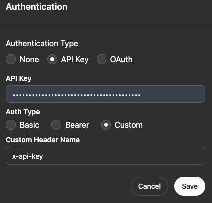
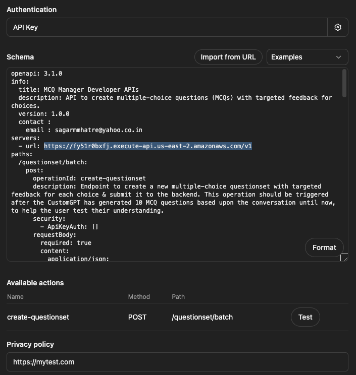

## Prerequisites

1. AWS Account ,  [AWS CLI](https://docs.aws.amazon.com/cli/latest/userguide/getting-started-install.html) 
2. Terraform 
3. Git 
4. ChatGPT Plus / Pro Subscription 

## Step 1 : Create AWS resources

Run the Terraform script to create the resources within your AWS Account.
This will create 3 DynamoDB Tables, an API Gateway (+ API Key to access it) & a user whose credentials will be used later by the Web UI.

Note : you may optionally change the region in the [infra/terraform.auto.tfvars](./infra/terraform.auto.tfvars) file 

```sh
cd infra
terraform init
terraform apply
```

### Test

Wait for a few (3-5) mins & then run the below to test if the API is operational

```sh

API_KEY=$(terraform output -raw mcq_api_key)
API_URL=$(terraform output -raw api_gw_url)

# echo $API_URL
# echo $API_KEY

curl --request POST "$API_URL/questionset/batch" \
  --header "Content-Type: application/json" \
  --header "x-api-key:$API_KEY" \
  --data '{
"questionsetid": "api-test-2503151722",
  "name": "AWS API GW Test",
  "description": "A set of questions to test knowledge on advanced features and use cases of AWS API Gateway.",
  "questions": [    
    {
      "text": "What is the primary purpose of AWS API Gateway?",
      "choices": [
        {
          "text": "To create, publish, maintain, monitor, and secure APIs at any scale.",
          "targetedResponse": "Correct! AWS API Gateway is a fully managed service that makes it easy to create and manage APIs.",
          "isCorrect": true
        },
        {
          "text": "To store and retrieve data with low latency.",
          "targetedResponse": "Incorrect. This describes Amazon DynamoDB, not API Gateway.",
          "isCorrect": false
        },
        {
          "text": "To manage serverless compute resources.",
          "targetedResponse": "Incorrect. This describes AWS Lambda, not API Gateway.",
          "isCorrect": false
        }
      ],
      "tags": [
        "api-gateway",
        "aws",
        "serverless"
      ]
    }
  ]
}'
```

Expected Output :

```json
{ "UnprocessedItems":{} }
```

## Step 2 : Set up Custom GPT 

```sh
# cd infra 

API_KEY=$(terraform output -raw mcq_api_key)
echo $API_URL

API_URL=$(terraform output -raw api_gw_url)
echo $API_KEY

```

Note down the above values 

Naviagate to https://chatgpt.com/gpts/mine

Create a new (or update your ) Custom GPT  
In the instructions, add : 

```txt
It can also generate MCQs and submit it to the backend using the API in the Actions
```

In the Configure Tab, scroll down to Actions. 
Click the Create new Action button

In the Authentication Field,   
- Authentication Type : API Key 
- Use the value from the above ($API_KEY) & insert it into API Key
- Auth Type : Custom 
- Custom Header Name : x-api-key



In the Schema , 
- copy paste the contents from the file [custom-gpt/openapi-mcq-mgr.yaml](./custom-gpt/openapi-mcq-mgr.yaml)
- Replace the URL with the value of the API URL from above 

e.g

```yaml
openapi: 3.1.0
info:
  title: MCQ Manager Developer APIs
  description: API to create multiple-choice questions (MCQs) with targeted feedback for choices.
  version: 1.0.0
  contact :
    email : sagarmmhatre@yahoo.co.in
servers:
  - url: https://6jdw8ba9u0.execute-api.us-east-2.amazonaws.com/v1

  ...

```

Privacy policy : https://mytest.com



## Step 3 : Run Web App

```sh
# cd infra

AWS_ACCESS_KEY_ID=$(terraform output -raw mcq_web_ui_access_key_id)
AWS_SECRET_ACCESS_KEY=$(terraform output -raw mcq_web_ui_secret_access_key)
AWS_REGION=us-east-2

# echo $AWS_ACCESS_KEY_ID
# echo $AWS_SECRET_ACCESS_KEY

cd ..

# Navigate to the application directory
cd app

docker build -t mcq-mgr:1.0 .

docker rm mcq-mgr -f

docker run -d -p 5002:5000 --name mcq-mgr -e AWS_ACCESS_KEY_ID=$AWS_ACCESS_KEY_ID -e  AWS_SECRET_ACCESS_KEY=$AWS_SECRET_ACCESS_KEY -e AWS_REGION=$AWS_REGION mcq-mgr:1.0 

```

Navigate to http://localhost:5002/static/dashboard.html


## Usage

Ask a few questions to your custom GPT

Then, use the below prompt : 

```txt
Generate 5 scenario-based MCQ questions & submit them to the backend.
```

In the Web UI , click Refresh. To start the Test, click the name of the Test


## AWS resources cleanup 

Note : Proceed with caution , will permanantly delete your data

```sh
cd infra
terraform destroy
```