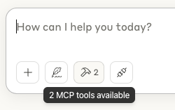

## Fine-Tune Your Certification Prep with AI-Generated MCQs

Get ready for your next professional certification exam—whether it’s AWS, Azure, GCP, or more—with OpenAI-powered, scenario-based MCQs designed to match real exam objectives.

Here’s how it works:
1.	🔧 Instantiate MCP Server 
2.	🔄 Connect Claude to MCP Server - enable it to submit MCQs to your database
3.	💻 Practice on a local web UI
4.	📊 Analyze your results and refocus your efforts on weak areas

Let’s make prep smarter, faster, and more focused.

Happy Learning!

<hr>

### Prerequisites

1. AWS Account , [AWS CLI](https://docs.aws.amazon.com/cli/latest/userguide/getting-started-install.html) 
2. Terraform 
3. [Claude](https://claude.ai/download)
4. Docker

### Step 1 : Create AWS resources

Run the Terraform script to create the resources within your AWS Account.
This will create 3 DynamoDB Tables & a user whose credentials will be used later by the MCP & the Web UI.

Note : you may optionally change the region in the [infra/terraform.auto.tfvars](./infra/terraform.auto.tfvars) file 

```sh
cd infra
terraform init
terraform apply
```
### Step 2 : Build & Run the MCP Server

Note : Update the AWS Region Appropriately

```sh
AWS_REGION=us-east-2

# cd infra

AWS_ACCESS_KEY_ID=$(terraform output -raw mcq_web_ui_access_key_id)
AWS_SECRET_ACCESS_KEY=$(terraform output -raw mcq_web_ui_secret_access_key)

# echo $AWS_ACCESS_KEY_ID
# echo $AWS_SECRET_ACCESS_KEY

cd ..

# Navigate to the application directory
cd mcp-server

echo AWS_ACCESS_KEY_ID=$AWS_ACCESS_KEY_ID > .env
echo AWS_SECRET_ACCESS_KEY=$AWS_SECRET_ACCESS_KEY >> .env
echo AWS_REGION=us-east-2 >> .env

# cat .env

docker rm mcq-mcp-server -f
docker rm mcq-mcp-server-claude -f
docker image rm mcq-mcp-server:1.0 

docker build -t mcq-mcp-server:1.0 .

# TODO : Find a more secure way to handle credentials. For now, managing via .env file. 
# Delete .env file after image is generated
rm .env

docker run -d --name mcq-mcp-server mcq-mcp-server:1.0 

# Check ...
docker container ls -n 1

# Clean up ( Claude will run it's own container)
docker rm mcq-mcp-server -f

```

### Step 3 : Set up Claude

Claude > Settings > DEveloper > Edit Config 

```js
{
  "mcpServers": {    
    "mcq-docker-shell":
    {
      "command": "docker",
      "args": [
        "run",
        "-i",
        "--rm",
        "--init", 
        "--name" , "mcq-mcp-server-claude",
        "-e", "DOCKER_CONTAINER=true",
        "mcq-mcp-server:1.0"
      ]
    } // , ... Other MCP Servers
  }
}
```

Restart Claude . It will show the docker container starting 

```sh
# Check ...
docker container ls -n 1

```




```

Optional : Create Style

```txt

Audience are Software professional preparing for the AWS Solutions Architect Associate certification exam. They prefer clear explanations, practice questions, and guidance tailored to the topics covered in the SAA-C03 exam - AWS services, architecture best practices, and core concepts like high availability, fault tolerance, cost optimization, and security. Use real-world examples and visual aids when helpful, and adapt explanations to the user's technical level and learning style. Avoids outdated content and focus only on what's relevant to the Associate-level exam. 
```

### Step 4 : Run Web App

```sh
# cd ..
# cd infra

AWS_ACCESS_KEY_ID=$(terraform output -raw mcq_web_ui_access_key_id)
AWS_SECRET_ACCESS_KEY=$(terraform output -raw mcq_web_ui_secret_access_key)
AWS_REGION=us-east-2

# echo $AWS_ACCESS_KEY_ID
# echo $AWS_SECRET_ACCESS_KEY

cd ..

# Navigate to the application directory
cd app

docker build -t mcq-mgr:1.0 .

docker rm mcq-mgr -f

docker run -d -p 5002:5000 --name mcq-mgr -e AWS_ACCESS_KEY_ID=$AWS_ACCESS_KEY_ID -e  AWS_SECRET_ACCESS_KEY=$AWS_SECRET_ACCESS_KEY -e AWS_REGION=$AWS_REGION mcq-mgr:1.0 

open http://localhost:5002/static/dashboard.html

```

Navigate to http://localhost:5002/static/dashboard.html


## Usage

Ask a few questions to your custom GPT

Then, use the below prompt : 

```txt
Generate 5 scenario-based MCQ questions & submit them to the backend.
```

In the Web UI , click Refresh. To start the Test, click the name of the Test


### AWS resources cleanup 

Note : Proceed with caution , will permanantly delete your data

```sh
cd infra
terraform destroy
```

## Architecture :

Hybrid Cloud [ AWS + (on-prem = our local machine :) ) ]
  - AWS Serverless
    - API Gateway
      - Provides a REST API to insert Question Set
      - Secured Key based Authentication
    - DynamoDB Tables
      - Stores Question sets, Questions & score for the latest attempt
  - Local Docker
    - Python Backend
      - REST endpoint for CRUD operations on the DynamoDB Table
      - Secured access to DynamoDB Tables via API Keys 
    - HTML , Javascript Frontend
      - Provides UI for practicing exam
      - Tabular Report based on lattest attempts


```sh

terraform state list

terraform state show aws_iam_policy.mcq_apigw_dynamodb

terraform taint module.iam_user_module.aws_iam_access_key.mcq_web_ui_access_key
terraform apply

terraform state rm 

# aws_api_gateway_usage_plan.mcq_usage_plan
# aws_api_gateway_usage_plan_key.mcq_usage_plan_key

```